<div align="justify">

# Programação de Funcionalidades

Nesta seção estão descritos os artefatos e estruturas de dados criados para atender aos requisitos previstos nas <a href="./especification.md">Especificações do Projeto</a>, bem como as instruções para acesso e verificação da implementação. As tecnologias utilizadas se baseiam nas linguagens HTML, CSS e JavaScript.

 ---

## Cadastros

### Requisitos: 
- RF-001	Permitir que o usuário cadastre um animal para adoção	
- RF-002	Permitir que o usuário cadastre um animal perdido

Para atender aos requisitos RF-001 e RF-002 foi desenvolvido os formulários de preenchimentos para os cadastros dos pets, os formulários são acessados através dos botões diponibilizados nas paginas Pets perdidos `/lost-pets/` ou adoção `/adoption-pets/` .

<div display: block;
    margin-left: auto;
    margin-right: auto>
 
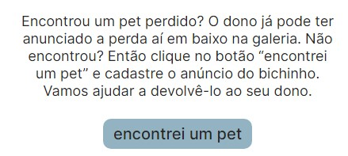
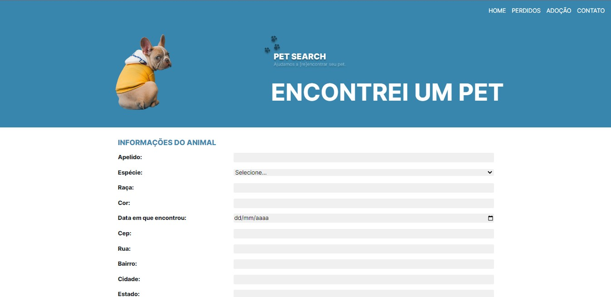 <br>
---
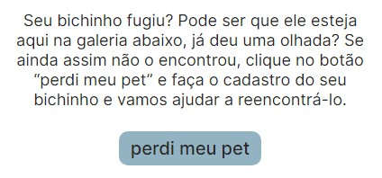
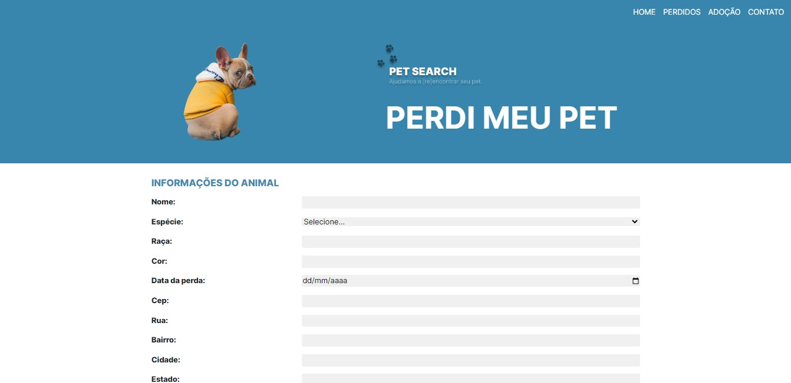 <br>
---
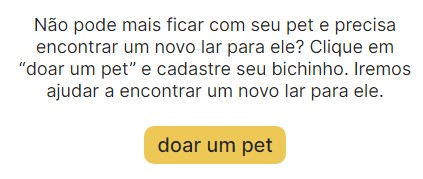
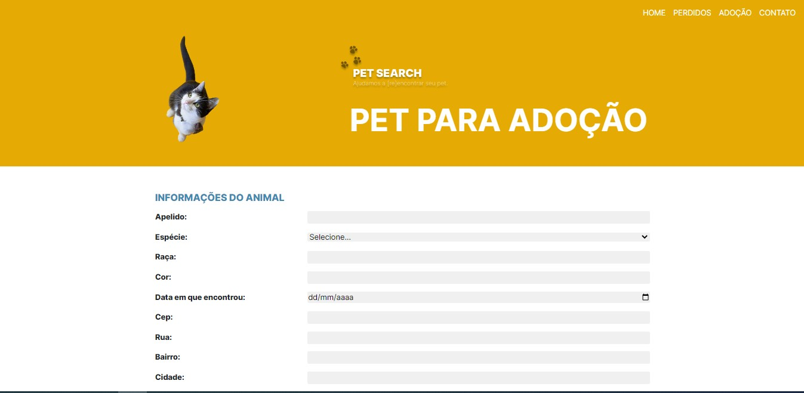<br>
 
 </div>
---
 ### Marcação de animais encontrados ou adotados
- RF-003	Permitir que o usuário marque o animal como "encontrado"
- RF-004	Permitir que o usuário marque o animal como "adotado"

---
 ### Filtro personalizado de pesquisa 
- RF-005    Disponibilizar funcionalidade que permita pesquisar animais com filtro personalizado

Para atender ao requisito RF-005 foi desenvolvido o filtro de pesquisa de acordo com o tipo do animal. O filtro está disponível nas galerias `/lost-pets/lost-gallery.html` e `/adoption-pets/adoption-gallery.html`.

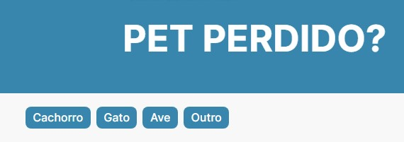
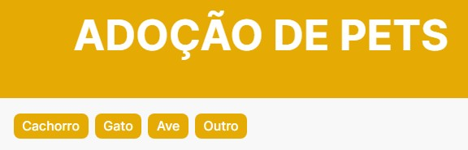<br>

---
### Seção ONG  
- RF-006	Disponibilizar funcionalidade que permita pesquisar ONG cadastradas	
- RF-007    Disponibilizar sessão com dados para doações às ONGs

A seções relacionadas às ONGs será disponibilizada na versão 2.0 da aplicação. 

---
### Outras funcionalidades.


Foi desenvolvido uma barra de navegação do tipo `nav-link` horizontal que contém botões relacionados as páginas da aplicação.

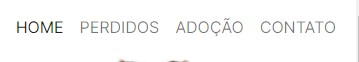<br>
 
---
 
Além da barra de navegação, foi criado na Homepage os Banners relacionados aos tipos de buscas ou cadastrados que direciona o usuário ao destino desejado ao clicar no botão `Saiba mais`. 

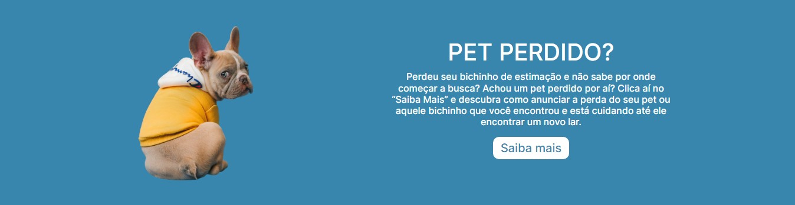
<br>

---
Ao clicar nos botões `Saiba mais`, o usuário são direcionados para as páginas abaixo:

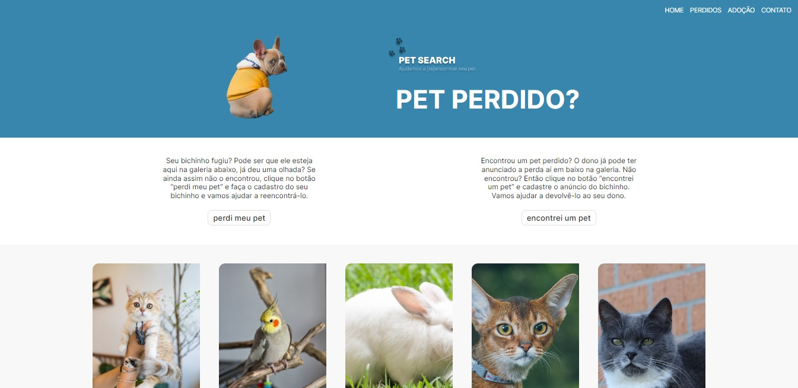
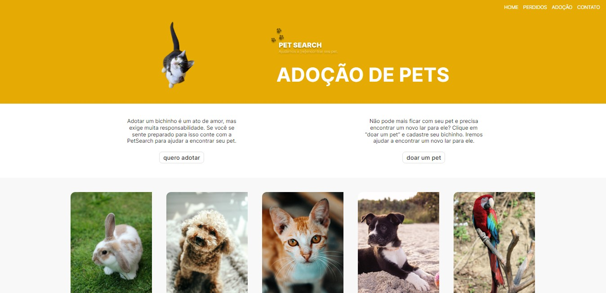<br>

---
Nas páginas dos Pets perdidos e Adoções, foi desenvolvido um botão que direciona o usuário para a galeria que contém todos os pets cadastrados nas suas respectivas seções `/lost-pets/lost-gallery.html` ou `/adoption-pets/adoption-gallery.html`: 

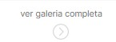<br>

Logo abaixo do botão `Ver galeria` foi implementado através da api OpenStreetMap um map com os pins relacionados aos pets catradastados. 

<br>

Ao clicar em um dos pet casdastrado será exibido a página abaixo relacionado ao pet escolhido, o usuário terá acesso a todas as informações do animal e do tutor. 

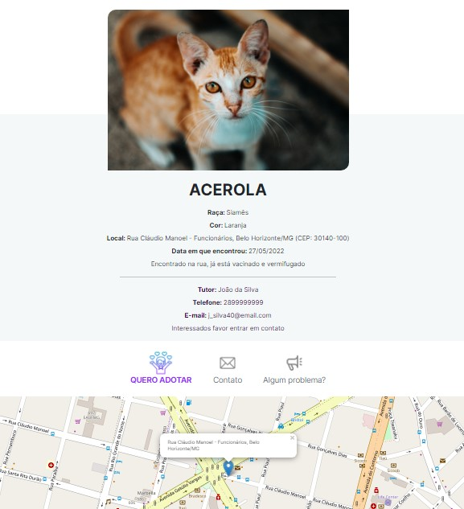<br>

essa página conta com botões de: 

<br>
<br>
<br>

*ENCONTREI* , *SOU DONO* E *QUERO ADOTAR* esses botões direciona o usuário para a tela de contato, que envia um e-mail ao tutor através da API Formspree.

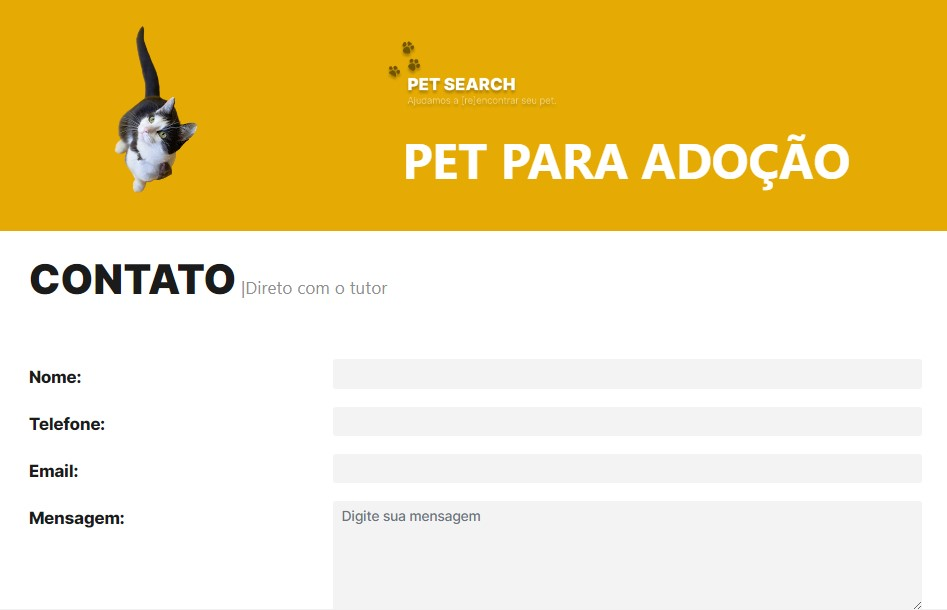<br>

Além desses botões a página possui outros dois botões:

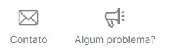<br>

Ao clicar no botão *CONTATO* o usuário será direcionado para a página de contato da `PetSearch`:

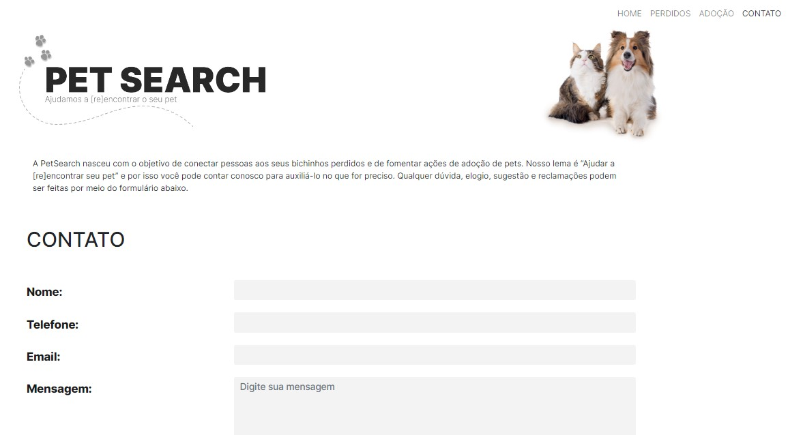<br>

Clicando no botão *RELATAR UM PROBLEMA*, o usuário será direcionado para um formulário de preenchimento, onde ele poderá descrever o problema encontrado: 

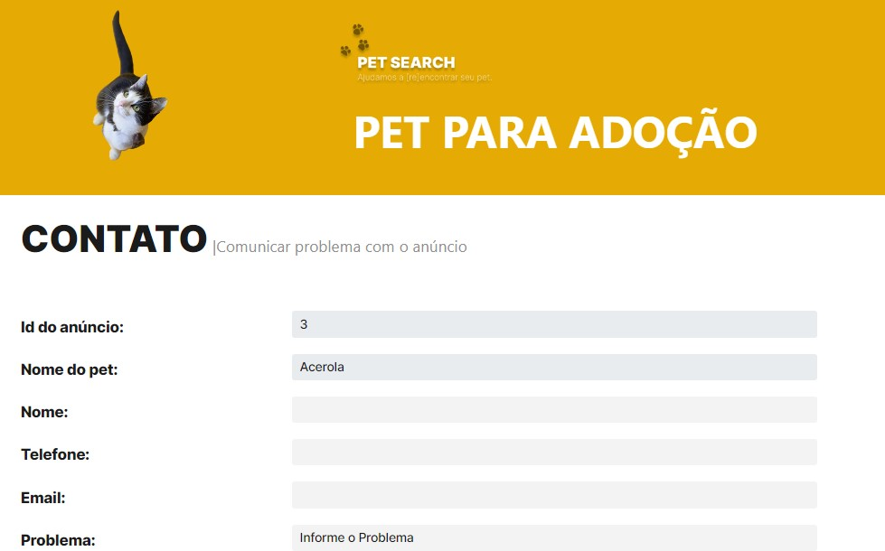<br>

No final da página encontra-se um mapa com a geolocalização do pet. 

A estrutura de dados utilizada é JSON, conforme exemplo a seguir:

```
"adoption-pets":[
        {
        "name": "Acerola",
        "species": "felino",
        "race": "Siamês",
        "color": "Laranja",
        "foundDate": "2022-05-28",
        "observations": "Encontrado na rua, já está vacinado e vermifugado",
        "tutorName": "João da Silva",
        "tutorPhone": "2899999999",
        "tutorEmail": "j_silva40@email.com",
        "tutorObservations": "Interessados favor entrar em contato",
        "cep": "30140-100",
        "street": "Rua Cláudio Manoel",
        "neighborhood": "Funcionários",
        "city": "Belo Horizonte",
        "state": "MG",
        "imageUrl": "https://i.imgur.com/jF7Az6I.jpg",
        "id": 3,
        "adopted": false
        }
]
```

</div>
